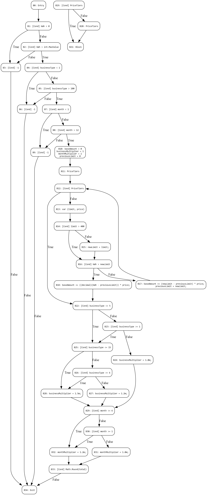

# ElectricBill

1.	Bài toán

Chức năng Electricity Bill Calculation là một module chịu trách nhiệm tính toán tổng tiền điện phải thanh toán cho một khách hàng trong một tháng dựa trên các yếu tố:

•	Số kWh tiêu thụ trong tháng,

•	Loại hình kinh doanh / đối tượng sử dụng (doanh nghiệp/hộ gia đình/phòng trọ/chung cư) được thể hiện qua businessType,

•	Tháng tiêu thụ (để áp hệ số mùa vụ).

Mục tiêu: tính toán chính xác số tiền cần thanh toán của hóa đơn điện.

2.	Đặc tả yêu cầu

Cần có chức năng tính tiền điện với các đầu vào gồm:

•	w : Số kWh tiêu thụ (số thực >0)

•	t : Số hộ gia đình sử dụng điện. Với số lượng hộ gia đình được quy định để phân chia thành Hộ gia đình, kinh doanh phòng trọ, kinh doanh chung cư. Các khách hàng kinh doanh phòng trọ sẽ có hệ số nhân là 1.2 và kinh doanh chung cư sẽ có hệ số nhân là 1.5.

•	m : Tháng tiêu thụ điện. Các tháng cao điểm sẽ được nhân với hệ giá 1.2.

3.	PipeLine thực hiện

Chương trình cần test được viết bởi C#.

Bước 1: Sử dụng Compiler của C# (Roslyn) phân tích cú pháp và xây dựng AST (Abstract Syntax Tree).

Bước 2: Xây dựng CFG. Tuy nhiên Roslyn đã phân rã các điều kiện phức dẫn đến CFG đã chia nhỏ các điều kiện.

Bước 3: Từ CFG sử dụng thuật toán DFS để tìm ra tất cả test path.

Kết quả tạo CFG

 

Bước 4: Tìm các test path theo điều kiện: phủ lệnh, phủ nhánh, phủ đường.

Bước 5: Từ các test path đưa vào Z3: xây dựng các điều kiện ràng buộc để tính toán Input cho từng test case.

Bước 6: Tính Expected output với từng test case.

Bước 7: Chạy các bộ test.

4.	Phủ Lệnh

Phủ lệnh gồm 3 test Path

5.	Phủ Nhánh

Phủ nhánh gồm 5 test Path

6.	Phủ Đường

Phủ đường gồm 69 test Path

## Cấu trúc dự án.
📁 ElectricBill/

│

├── 📁 src/ElectricBill.App/                    # Dự án tính hóa đơn điện

├────── ElectricBillCalculator.cs               # Hàm tính toán hóa đơn điện CalculateElectricBill

├────── CFGGenerator.cs                         # Class tao CFG bằng Roslyn

├────── CfgPathFinder.cs                        # Class tìm test path bằng DFS và lọc test path theo độ phủ: Lệnh, nhánh, đường

├────── TestInputGenerator.cs                   # Sinh input cho test bằng Z3 (chưa hoàn thiện logic cho các điều kiện phức)

├── 📁 Test/ElectricBill.Test/                  # Các Unit Test và Test Data

├────── 📁 TestData

├───────── BoundaryTests.json                   # Bộ test kiểm thử biên

├───────── EquivalenceTests.json                # Bộ test kiểm thử tương đương

├───────── DecisionTests.json                   # Bộ test kiểm thử bảng quyết định

├────── ElectricBillCalculatorTests.cs          # Unit Test của hàm CalculateElectricBill

└── README.md   
