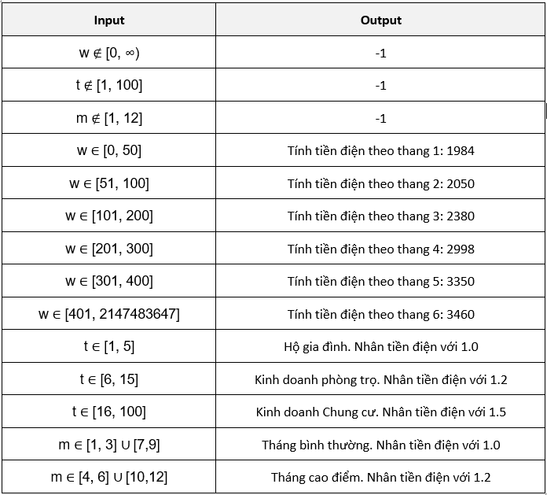
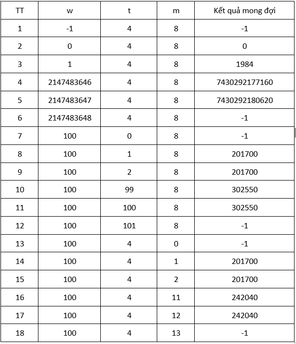
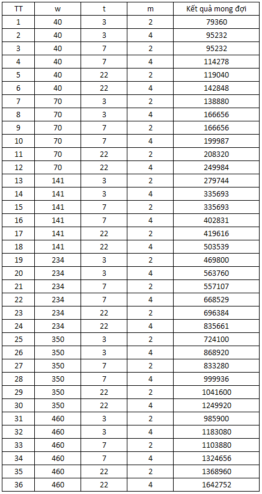
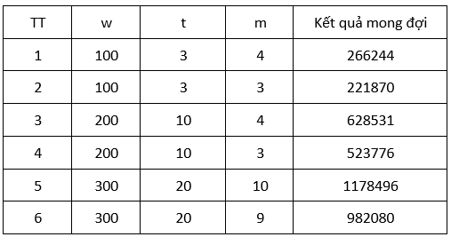

# ElectricBill
1.	Bài toán
Chức năng Electricity Bill Calculation là một module chịu trách nhiệm tính toán tổng tiền điện phải thanh toán cho một khách hàng trong một tháng dựa trên các yếu tố:
•	Số kWh tiêu thụ trong tháng,
•	Loại hình kinh doanh / đối tượng sử dụng (doanh nghiệp/hộ gia đình/phòng trọ/chung cư) được thể hiện qua businessType,
•	Tháng tiêu thụ (để áp hệ số mùa vụ).
Mục tiêu: tính toán chính xác số tiền cần thanh toán của hóa đơn điện.
2.	Đặc tả yêu cầu
Cần có chức năng tính tiền điện với các đầu vào gồm:
•	w : Số kWh tiêu thụ (số thực >0)
•	t : Số hộ gia đình sử dụng điện. Với số lượng hộ gia đình được quy định để phân chia thành Hộ gia đình, kinh doanh phòng trọ, kinh doanh chung cư. Các khách hàng kinh doanh phòng trọ sẽ có hệ số nhân là 1.2 và kinh doanh chung cư sẽ có hệ số nhân là 1.5.
•	m : Tháng tiêu thụ điện. Các tháng cao điểm sẽ được nhân với hệ giá 1.2.
Mối quan hệ input-output

3.	Kiểm thử biên
Kiểm thử biên sẽ tiến hành với bộ test gồm 18 test case gồm cả cận biên hợp lệ và cận biên không hợp lệ.

4.	Kiểm thử tương đương
Kiểm thử tương đương mạnh với bộ test gồm 36(6x3x2) test case: 

5.	Kiểm thử bảng quyết định
Kiểm thử bảng quyết định có 6 Testcase sau:

